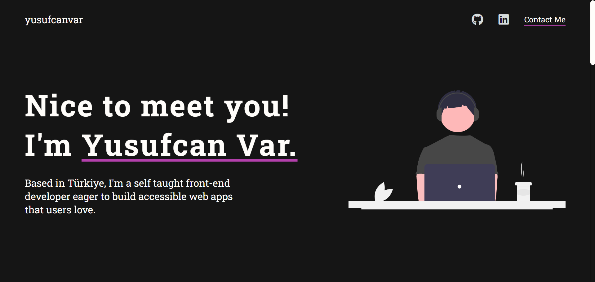

# Portfolio Project

Welcome to my Portfolio Project repository! This project showcases my skills, projects, and experiences as a developer.

## Table of Contents
- [Introduction](#introduction)
- [Features](#features)
- [Technologies Used](#technologies-used)
- [Screenshots](#screenshots)
- [Contact](#contact)

## Introduction

This portfolio project is a comprehensive display of my work, including projects I have completed, technologies I am proficient in, and my professional journey. 
It is a personal website where I can share my achievements and experiences with potential employers, collaborators, and the tech community.

## Features

- **Homepage**: A brief introduction and links to various sections.
- **About Me**: Information about my background, skills, and interests.
- **Projects**: A showcase of my projects with descriptions, technologies used, and links to live demos or repositories.
- **Contact**: A contact form for visitors to contact me.

## Technologies Used

- **Frontend**: HTML, CSS, JavaScript
- **Deployment**: GitHub Pages

## Screenshots

-Here are some screenshots of the portfolio:

## Contact
- Feel free to contact me through the contact form on my portfolio website or connect with me on [LinkedIn](https://www.linkedin.com/in/clotho/).
